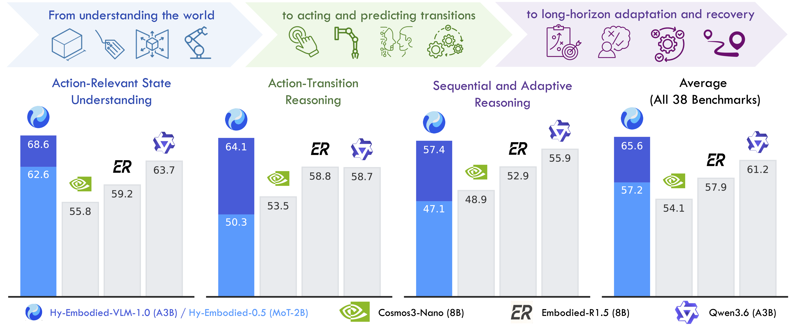
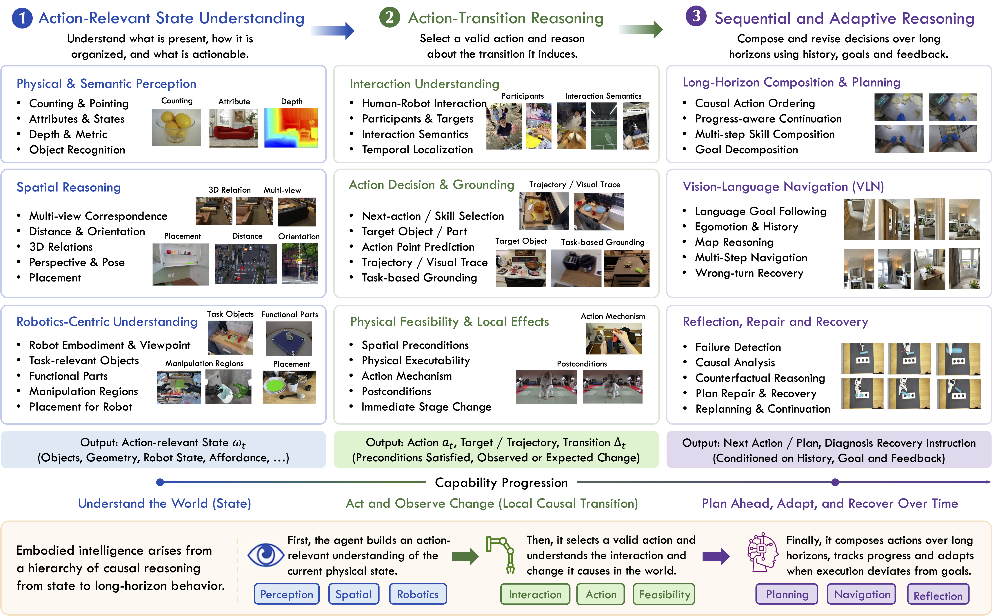

<div align="center">
<h1>Hy-Embodied-VLM-1.0</h1>
<p><b>Efficient Physical-World Agents</b></p>
<p><i>Tencent Robotics X × Hy Vision Team × Futian Laboratory</i></p>

<a href="https://arxiv.org/abs/2607.12894"></a>
<a href="hy_embodied_vlm_1_0_tech_report.pdf"></a>
<a href="https://huggingface.co/tencent/Hy-Embodied-VLM-1.0"></a>
<a href="./LICENSE"></a>

</div>

## 🔥 Updates

  * **`[2026-07-15]`** 🚀 We have released **Hy-Embodied-VLM-1.0**! An efficient 30B Mixture-of-Experts vision–language foundation model for embodied agents in the physical world. Weights are available on [Hugging Face](https://huggingface.co/tencent/Hy-Embodied-VLM-1.0), together with inference code for both HuggingFace `transformers` and vLLM.
  * **`[2026-06-15]`** 🤖 We have released **HY-VLA-0.5**! The [official code](https://github.com/Tencent-Hunyuan/Hy-Embodied-0.5-VLA), UMI-trained [weights](https://huggingface.co/tencent/Hy-Embodied-0.5-VLA-UMI) and 2000+ hours of high-fidelity UMI [data](https://huggingface.co/datasets/tencent/Hy-Embodied-0.5-VLA-Data) are now available.
  * **`[2026-04-09]`** 🚀 We have released **HY-Embodied-0.5**, featuring the open-sourced `HY-Embodied-0.5 MoT-2B` weights on [Hugging Face](https://huggingface.co/tencent/HY-Embodied-0.5/tree/main) along with the official inference code! Documentation is now available under [`Hy-Embodied-0.5/`](./Hy-Embodied-0.5/).

## 📖 Abstract

Building capable embodied agents requires not only multimodal perception and understanding, but also agentic capabilities for reasoning about actions, adapting to evolving situations, and interacting with the physical world. In this report, we introduce **Hy-Embodied-VLM-1.0**, an efficient and powerful embodied foundation model specifically designed for embodied agents operating in the physical world.

To cultivate such capabilities from the pre-training stage onward, we define an **action-centric capability taxonomy** comprising three progressive dimensions: **Action-Relevant State Understanding**, **Action–Transition Reasoning**, and **Sequential and Adaptive Reasoning**. Guided by this taxonomy, we develop a systematic data pipeline and curate data mixtures spanning both pre-training and post-training.

To deliver strong physical-world understanding and interaction capabilities while supporting latency-sensitive deployment, we build our model on the **Hy3-A3B language backbone** and the **Hy-ViT2 vision encoder**. Its efficient Mixture-of-Experts architecture combines strong model capacity with high inference efficiency. We evaluate Hy-Embodied-VLM-1.0 on a comprehensive suite of **38 benchmarks** covering embodied perception, physical-world understanding, and embodied reasoning. The model achieves the best performance among similarly sized models on **19 of the 38 benchmarks** and substantially outperforms strong competitors, including **Qwen3.6-A3B** and **Cosmos 3**. Compared with the previous-generation Hy-Embodied-0.5 MoT-2B, Hy-Embodied-VLM-1.0 improves average performance by **8.4%**. Despite activating only **3B parameters**, it achieves performance close to that of the previous-generation model with 32B activated parameters. Beyond static benchmark evaluation, Hy-Embodied-VLM-1.0 also demonstrates strong performance on embodied agentic tasks requiring multi-turn interaction and long-horizon reasoning.

<div align="center">

</div>

## ⭐️ Key Features

  * 🧠 **Efficient 30B MoE, ~3B activated** — Combines the Hy3-A3B language backbone with the Hy-ViT2 vision encoder in a Mixture-of-Experts architecture. Total ~30B parameters with only ~3B activated per token — approximately one-tenth of the activated parameters of the previous-generation A32B system, while achieving nearly comparable overall performance.
  * 🌏 **Action-Centric Capability Taxonomy** — We define three progressive levels of embodied intelligence: (i) **Action-Relevant State Understanding** for accurately understanding the states of the agent and its environment, (ii) **Action–Transition Reasoning** for understanding actions, planning them, and reasoning about their consequences, and (iii) **Sequential and Adaptive Reasoning** for long-horizon planning, reflection, repair, and recovery. Data and training are systematically designed around this taxonomy.
  * 🔁 **Self-Evolving Post-Training** — Embodied agentic reasoning is cultivated through a self-evolving loop that couples reinforcement learning with rejection-sampling fine-tuning, seeded from a small curated set of high-quality thinking traces. A final reward-specialized stage trains continuous-reward and discrete-reward RL policies separately and fuses them, delivering sharp geometric precision alongside robust decision-making, planning, and reflection quality.
  * 🏆 **State-of-the-Art on Embodied Benchmarks** — Ranks 1st on 19 of 38 benchmarks and 2nd on another 11, outperforming Qwen3.6-A3B (+4.4% avg), Cosmos 3-8B, and Embodied-R1.5-8B. State-of-the-art on R2R-CE vision-and-language navigation (RGB-only setting) and strong zero-shot performance on Matterport3D Object Goal Navigation.

<div align="center">

</div>

## 📅 Plannings

- [x] Transformers Inference
- [x] vLLM Inference (with in-tree plugin)
- [x] Model Weights
- [ ] Fine-tuning Code
- [ ] Online Gradio Demo

## 🛠️ Dependencies and Installation

### Prerequisites

- 🖥️ **Operating System**: Linux (recommended)
- 🐍 **Python**: 3.10+
- ⚡ **CUDA**: 12.x (H100 / H20 / A100 tested)
- 🔥 **PyTorch**: 2.4+
- 🎮 **GPU**: NVIDIA GPU(s). The full BF16 model requires ~86 GB across GPUs; a single 8×80 GB node is sufficient.

### Installation

We pin dependencies to the versions we validated end-to-end
(`vllm==0.14.1` + `transformers==4.57.6` + `torch==2.9.1`). The cleanest
way to install these — with the CUDA build matched to your driver — is
[uv](https://docs.astral.sh/uv/):

```bash
# Install uv once (skip if you already have it)
curl -LsSf https://astral.sh/uv/install.sh | sh

# Create a fresh venv (Python 3.10+)
uv venv --python 3.12
source .venv/bin/activate
```

**Option A — vLLM path (recommended for serving)**. A single `uv` command
installs `vllm`, `transformers`, `torch`, `torchvision`, and picks the
CUDA wheel that matches your driver:

```bash
uv pip install vllm==0.14.1 --torch-backend auto
uv pip install -e Hy-Embodied-VLM-1.0/inference/vllm/    # our plugin
```

**Option B — HuggingFace `transformers` path (single-instance inference)**:

```bash
uv pip install torch==2.9.1 torchvision==0.24.1 --torch-backend auto
uv pip install transformers==4.57.6 accelerate pillow
```

Verify: `python -c "import torch; assert torch.cuda.is_available()"`.

### Quick Start

1. **Clone the repository:**

```bash
git clone https://github.com/Tencent-Hunyuan/HY-Embodied
cd HY-Embodied
```

2. **HuggingFace `transformers` (single-instance):**

```bash
# Install deps (see Installation above)
uv pip install torch==2.9.1 torchvision==0.24.1 --torch-backend auto
uv pip install transformers==4.57.6 accelerate pillow

# Run the demo
cd Hy-Embodied-VLM-1.0/inference/transformers
python infer_hf.py
```

The demo runs both single-image inference and a small batch, in `enable_thinking=True` (chain-of-thought) and `enable_thinking=False` (direct answer) modes.

3. **vLLM (recommended for serving):**

```bash
# One-shot install: vllm + torch + torchvision + transformers all at
# matching versions with the CUDA build picked from your driver.
uv pip install vllm==0.14.1 --torch-backend auto

# Install this repo's vLLM plugin (registers HYV3VL model + parsers)
uv pip install -e Hy-Embodied-VLM-1.0/inference/vllm/

# Start server
MODEL_PATH=./Hy-Embodied-VLM-1.0-weights bash Hy-Embodied-VLM-1.0/inference/vllm/serve.sh
```

Then hit the OpenAI-compatible endpoint:

```bash
curl http://127.0.0.1:8080/v1/chat/completions \
  -H "Content-Type: application/json" \
  -d '{
    "model": "hy_a3b",
    "messages": [{"role": "user", "content": "Describe how to grasp a cup."}],
    "max_tokens": 512,
    "chat_template_kwargs": {"enable_thinking": true}
  }'
```

See [`Hy-Embodied-VLM-1.0/inference/vllm/README.md`](./Hy-Embodied-VLM-1.0/inference/vllm/README.md) for full options and [`example_client.py`](./Hy-Embodied-VLM-1.0/inference/vllm/example_client.py) for a Python OpenAI-SDK example including image inputs and streaming.

### Reasoning-Mode Toggle

Hy-Embodied-VLM-1.0 is a **hybrid reasoning model**. Both modes are trained into the same weights; selection is per-request via a chat-template kwarg.

| `enable_thinking` | Prompt suffix | When to use |
|---|---|---|
| `True` (default) | `<think>` | Complex spatial reasoning, planning, multi-step tasks |
| `False` | `<think></think>` | Direct answers, low-latency single-turn Q&A |

> We deliberately use `enable_thinking` (Qwen3 convention) rather than
> `reasoning_effort`. vLLM prior to v0.22 has a top-level
> `request.reasoning_effort` field that silently clobbers
> `chat_template_kwargs["reasoning_effort"]` (fixed by
> [vllm-project/vllm#43401](https://github.com/vllm-project/vllm/pull/43401));
> `enable_thinking` avoids the clobber and works across all vLLM versions.

### Model Download

The code automatically downloads the model `tencent/Hy-Embodied-VLM-1.0` from the Hugging Face Hub on first run. Ensure you have sufficient disk space (~120 GB including cache) for the model weights.

### Hardware Requirements

- **Training / full-precision inference**: A single 8×80 GB GPU node (H100 / H20 / A100 80G). Model weights are BF16 (~86 GB); tensor-parallel size 4–8 recommended.
- **Serving**: 4 GPUs of 80 GB (tp=4) per replica is the recommended configuration for maximum throughput.
- **Development / debugging**: Any CUDA GPU. Smaller GPUs may require offloading or additional tensor parallelism.

## 🧱 Model Card

| Field | Value |
|---|---|
| Architecture | `HYV3VLForConditionalGeneration` (VL wrapper over `HYV3ForCausalLM` MoE LLM + `Hy-ViT2` vision encoder) |
| Model type | `hy_v3_vl` |
| Total parameters | ~30B |
| Activated parameters per token | ~3B (8 of 128 experts + 1 shared) |
| Context length | 32,768 tokens |
| Precision | BF16 |
| Vision inputs | Image (up to 128 per prompt); native aspect ratios |
| Chat template | Unified `chat_template.jinja` bundled with weights (supports `enable_thinking` kwarg) |

## 📊 Evaluation

> **Note**: We evaluated Hy-Embodied-VLM-1.0 A3B across 38 embodied-relevant benchmarks
> against parameter-comparable state-of-the-art models. For detailed methodology, please
> refer to our [technical report](hy_embodied_vlm_1_0_tech_report.pdf).

### Action-Relevant State Understanding

| Benchmark | Hy-Embodied 0.5 MoT-2B | Qwen3.6-A3B | Embodied-R1.5 8B | Cosmos3-Nano 8B | Hy-Embodied VLM-1.0 A3B |
|-----------|:----------------------:|:-----------:|:----------------:|:---------------:|:-----------------------:|
| BLINK | 82.7 | **87.9** | 77.8 | 82.4 | 87.3 |
| CV-Bench | 89.2 | 88.6 | 86.8 | 88.0 | **89.7** |
| PixMo-Points | 51.4 | 57.5 | 57.1 | 59.8 | **64.6** |
| PointBench | 69.0 | 35.1 | 59.1 | 39.2 | **71.7** |
| Depth-InHouse | 45.7 | 63.0 | 52.0 | 47.0 | **67.6** |
| 3DSRBench | **57.0** | 49.9 | 42.6 | 31.9 | 52.6 |
| All-Angles-Bench | 55.1 | **64.0** | 48.4 | 51.9 | 63.4 |
| DA-2K | **92.3** | 81.4 | 80.5 | 82.8 | 83.2 |
| ERQA | 54.5 | 57.5 | 37.3 | 45.0 | **60.8** |
| EmbSpatial-Bench | 82.8 | **83.2** | 76.0 | 80.0 | 82.7 |
| MMSI-Bench | 33.2 | **41.9** | 29.8 | 34.0 | 41.8 |
| MindCube | 66.3 | 55.0 | 27.9 | 32.8 | **70.0** |
| SAT | 76.7 | **80.7** | 60.7 | 54.0 | 78.0 |
| SIBench-mini | 58.2 | 60.9 | 51.9 | 52.5 | **64.5** |
| SITE-Bench-Image | 62.7 | 71.7 | 60.3 | 59.6 | **72.3** |
| ViewSpatial-Bench | 53.1 | 49.0 | 43.7 | 52.0 | **53.3** |
| OpenEQA | 54.4 | **73.2** | 53.9 | 53.8 | 63.1 |
| PartAfford | 30.1 | 25.5 | **82.6** | 32.2 | 63.7 |
| RoboAfford | 73.5 | 66.7 | 60.6 | **76.2** | 71.5 |
| RoboRefIt | 82.8 | 78.5 | 77.2 | 55.4 | **88.2** |
| RefSpatial-Bench | 45.8 | 53.1 | 52.4 | 44.4 | **53.4** |
| RoboSpatial-Home | 55.7 | **70.9** | 69.1 | 58.3 | 69.4 |
| Where2Place | 68.0 | 70.0 | **73.0** | 71.0 | 65.0 |

### Action–Transition Reasoning

| Benchmark | Hy-Embodied 0.5 MoT-2B | Qwen3.6-A3B | Embodied-R1.5 8B | Cosmos3-Nano 8B | Hy-Embodied VLM-1.0 A3B |
|-----------|:----------------------:|:-----------:|:----------------:|:---------------:|:-----------------------:|
| FineBench | 56.9 | 76.9 | 67.1 | 63.5 | **80.3** |
| CrossHOI-Bench | 40.7 | 58.0 | 55.1 | 51.0 | **63.2** |
| PIO | 54.6 | 47.9 | 61.6 | 54.4 | **65.3** |
| VABench-Point | 26.0 | 50.5 | **61.4** | 45.2 | 59.7 |
| VABench-Visual-Trace | 75.0 | 80.3 | **89.8** | 81.6 | 79.7 |
| ShareRobot-Bench-Affordance | 26.8 | **28.2** | 25.2 | 23.0 | 26.7 |
| ShareRobot-Bench-Trajectory | 73.3 | 68.9 | 69.2 | 65.5 | **76.7** |
| RoboBench-MCQ | 49.2 | 59.1 | 41.1 | 43.5 | **61.2** |

### Sequential and Adaptive Reasoning

| Benchmark | Hy-Embodied 0.5 MoT-2B | Qwen3.6-A3B | Embodied-R1.5 8B | Cosmos3-Nano 8B | Hy-Embodied VLM-1.0 A3B |
|-----------|:----------------------:|:-----------:|:----------------:|:---------------:|:-----------------------:|
| SITE-Bench-Video | 63.5 | **71.1** | 59.1 | 57.6 | 69.2 |
| VSIBench | **60.5** | 57.5 | 59.2 | 50.4 | 58.9 |
| EgoPlan2 | 45.5 | 49.9 | **61.0** | 42.6 | 49.6 |
| Cosmos | 54.3 | 67.8 | **68.6** | 67.1 | 66.9 |
| VLABench | 16.2 | 49.9 | 39.4 | 48.9 | **51.1** |
| RoboBench-Planning | 54.2 | 53.9 | 39.4 | 41.5 | **54.9** |
| RoboFAC | 35.6 | 41.4 | 43.9 | 34.4 | **51.0** |

*Note: Hy-Embodied variants and Qwen3.6-A3B are evaluated in thinking mode; Embodied-R1.5-8B is only available in its Instruct configuration; Cosmos3-Nano-8B is reported in non-thinking mode (enabling thinking substantially degrades its performance).*

## 📜 Older Versions

Prior releases of the Hy-Embodied family remain fully available:

| Version | Description | Location |
|---|---|---|
| **Hy-Embodied-0.5** (MoT-2B) | The first release: MoT architecture, 2B activated params, tuned for edge deployment | [`./Hy-Embodied-0.5/`](./Hy-Embodied-0.5/) |
| **Hy-Embodied-0.5-VLA** | UMI-trained VLA for real-robot manipulation | [Tencent-Hunyuan/Hy-Embodied-0.5-VLA](https://github.com/Tencent-Hunyuan/Hy-Embodied-0.5-VLA) |
| **Hy-Embodied-0.5-X** | Extended variant with additional post-training | [Tencent-Hunyuan/HY-Embodied-0.5-X](https://github.com/Tencent-Hunyuan/HY-Embodied-0.5-X) |

Documentation for Hy-Embodied-0.5 (previously at this repo's root) has been moved into
[`./Hy-Embodied-0.5/`](./Hy-Embodied-0.5/) to make room for the multi-version layout. All existing 0.5
code and instructions remain unchanged inside that directory.

## 📄 License

Released under **Apache License 2.0**. See [`LICENSE`](./LICENSE) and [`Hy-Embodied-VLM-1.0/LICENSE`](./Hy-Embodied-VLM-1.0/LICENSE).

## 🏷️ Citation

If you find our work useful for your research and applications, please cite our tech reports using this BibTeX:

```bibtex
@article{tencent2026hyembodiedvlm10,
  title         = {Hy-Embodied-VLM-1.0: Efficient Physical-World Agents},
  author        = {Team, HY and Wang, Ziyi and Yu, Xumin and Ling, Yonggen and Li, Yunheng and Rao, Yongming and Wang, Oran and Gao, Mingqi and Zhou, Yuchen and Liang, Yves and others},
  year          = {2026},
  eprint        = {2607.12894},
  archivePrefix = {arXiv},
  url           = {https://arxiv.org/abs/2607.12894}
}

@article{tencent2026hyembodied05,
  title         = {HY-Embodied-0.5: Embodied Foundation Models for Real-World Agents},
  author        = {Team, HY and Yu, Xumin and Liu, Zuyan and Wang, Ziyi and Zhang, He and Rao, Yongming and Liu, Fangfu and Zhang, Yani and Zhao, Ruowen and Wang, Oran and others},
  year          = {2026},
  eprint        = {2604.07430},
  archivePrefix = {arXiv},
  url           = {https://arxiv.org/abs/2604.07430}
}
```

## 🙏 Acknowledgements

Built on the [Hy3](https://huggingface.co/tencent/Hy3) MoE LLM backbone and the [Hy-ViT2](https://huggingface.co/tencent/HunyuanOCR) vision encoder. We thank the broader Tencent Hunyuan and Robotics X communities for infrastructure, evaluation resources, and design feedback.
